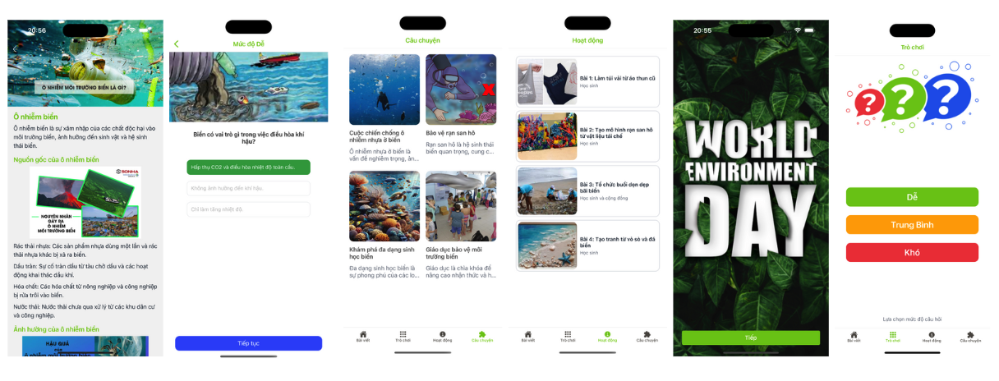

# Ocean Environment App - Knowledge and Exploration of Marine Environmental Protection

## Description:
The Ocean Environment App is a mobile application designed to educate users about marine environmental protection through interactive articles, games, stories, and activities. Users can explore a wealth of information about ocean pollution, its sources, effects, and the measures needed to combat it. The app aims to create awareness and inspire action towards a healthier marine environment.

The Ocean Environment App is compatible with both iOS and Android devices. 

**Main Features of the Ocean Environment App Include:**
- **Informative Articles:** Users can view articles about ocean pollution, each detailing its description, sources, effects, and protective measures.
- **Interactive Games:** Games are divided into three levels to help users easily select challenges according to their current knowledge level about marine environments.
- **Marine Protection Activities:** Engage in various activities that promote marine environmental sustainability.
- **Stories on Marine Environmental Protection:** Read inspiring stories that highlight the importance of protecting our oceans.
- **Curated Content:** All content is carefully selected, compiled, and deployed to ensure quality before being made available on the application.

## Technologies Used:
* [React Native:](https://reactnative.dev/) A framework that enables the development of cross-platform mobile applications, allowing the Ocean Environment App to run smoothly on both iOS and Android.
* [Redux Toolkit:](https://redux-toolkit.js.org/) A library that simplifies state management, providing a robust solution for managing application state and enhancing future scalability.
* [Supabase:](https://supabase.com/) An open-source backend as a service that offers several features:
  - **Authentication:** Secure user authentication to manage access to the app.
  - **Realtime Database:** A database that supports real-time data synchronization, allowing users to receive instant updates.
  - **File Storage:** A service to store images, articles, and other media files efficiently.
 
# Demo
[(./)](https://firebasestorage.googleapis.com/v0/b/food-donation-98ef2.appspot.com/o/env.mp4?alt=media&token=ef59813c-76ae-493d-8f5a-7cdad0cd37a2)
